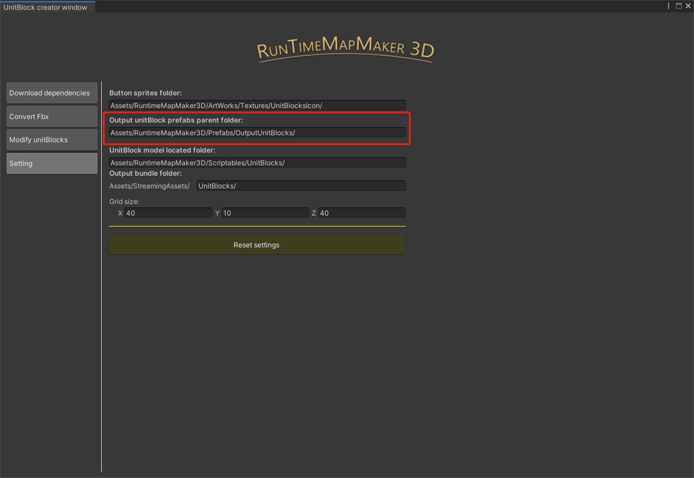

# 4️⃣ Convert prefab to UnitBlock

### Convert source prefab to UnitBlock:

* Before conversion, make sure you have created SourcePrefabTreeAsset, it is used to distinguish your unitBlock type.(You can create it by right click in the project panel "Create/RMM3D/TreeAssets/Source Prefab Tree Asset")

.png>)

* At "Convert Fbx" tab. You can see the SourcePrefabTreeAsset you created, drag and drop your source prefab to the treeview box on the left.

.png>)

* Up on the treeview box, you can choose what type of unitblock to convert.

.png>)

* After clicking the convert button, you can find the converted unitblock in the output directory.

.png>)

* Of course, you can also change the output directory in the settings tab.

